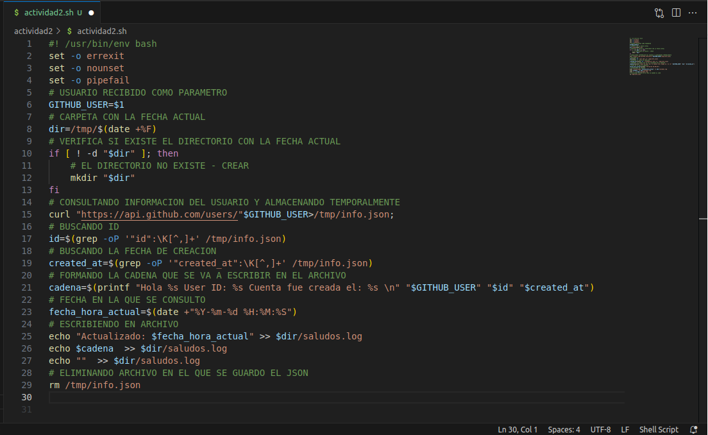
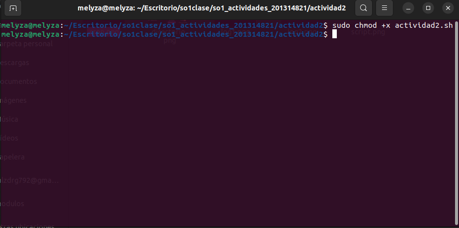
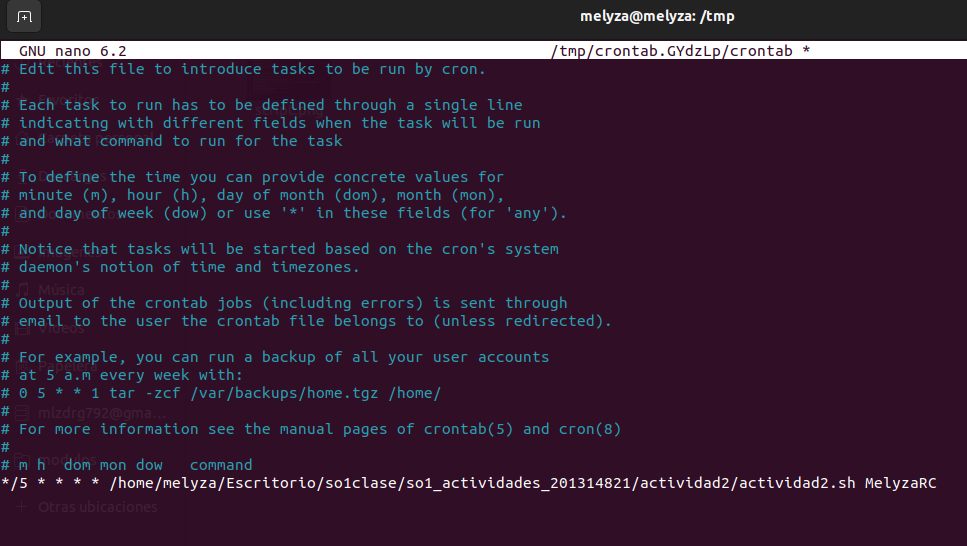
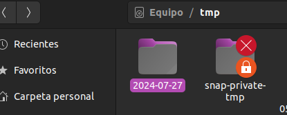
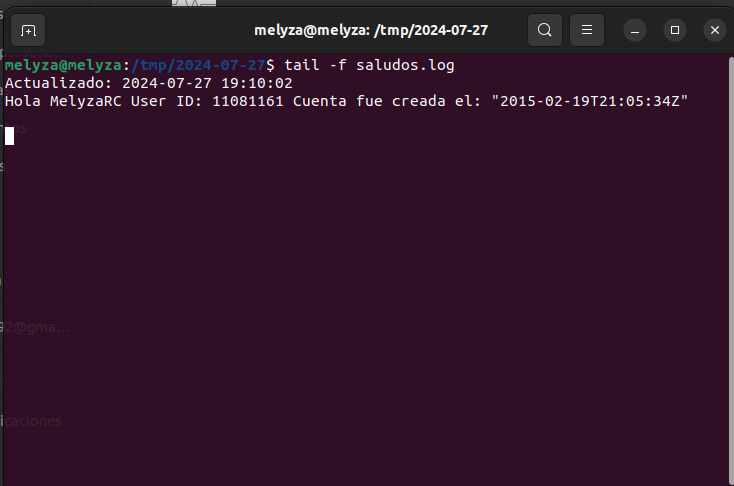
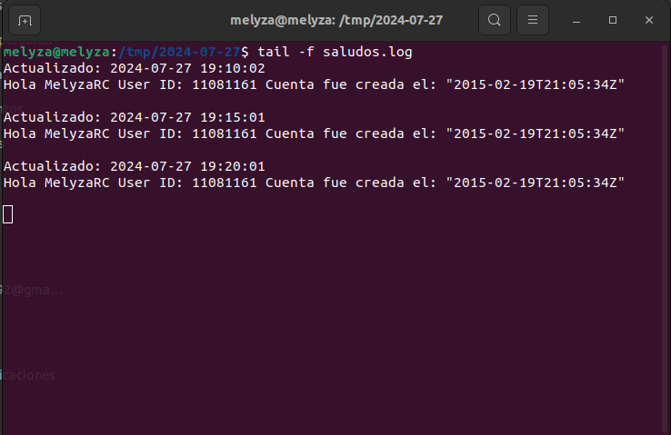

## Actividad 2 
# Scripting

### :computer: Script
El script utilizado para consultar la información de un usuario de ***GitHub***, es el siguiente: 

```
#! /usr/bin/env bash 
set -o errexit
set -o nounset
set -o pipefail 
# USUARIO RECIBIDO COMO PARAMETRO
GITHUB_USER=$1
# CARPETA CON LA FECHA ACTUAL
dir=/tmp/$(date +%F)
# VERIFICA SI EXISTE EL DIRECTORIO CON LA FECHA ACTUAL
if [ ! -d "$dir" ]; then
    # EL DIRECTORIO NO EXISTE - CREAR
    mkdir "$dir"
fi
# CONSULTANDO INFORMACION DEL USUARIO Y ALMACENANDO TEMPORALMENTE
curl "https://api.github.com/users/"$GITHUB_USER>/tmp/info.json;
# BUSCANDO ID
id=$(grep -oP '"id":\K[^,]+' /tmp/info.json)
# BUSCANDO LA FECHA DE CREACION 
created_at=$(grep -oP '"created_at":\K[^,]+' /tmp/info.json) 
# FORMANDO LA CADENA QUE SE VA A ESCRIBIR EN EL ARCHIVO
cadena=$(printf "Hola %s User ID: %s Cuenta fue creada el: %s \n" "$GITHUB_USER" "$id" "$created_at")
# FECHA EN LA QUE SE CONSULTO
fecha_hora_actual=$(date +"%Y-%m-%d %H:%M:%S")
# ESCRIBIENDO EN ARCHIVO
echo "Actualizado: $fecha_hora_actual" >> $dir/saludos.log
echo $cadena  >> $dir/saludos.log
echo ""  >> $dir/saludos.log
# ELIMINANDO ARCHIVO EN EL QUE SE GUARDO EL JSON
rm /tmp/info.json
```




> :warning: **IMPORTANTE**
>
> Se debe asignar permiso de **ejecución (x)** para el archivo en el que se encuentra el script a ser ejecutado.
> 
> 


### :clock2: Cronjob

Para crear un ***cronjob*** que ejecute el script creado cada 5 minutos, se debe editar el archivo ***crontab***. Para esto, ejecutamos el siguiente comando: 

```
crontab -e
```

Ahora, procedemos a ingresar el cronjob e la notaciòn correspodiente 

```
*/5 * * * * [ruta del archivo] [parámetros]
```



### :computer: Resultado

Podemos ver el funcionamiento del ***cronjob***, el cual ejecuta cada 5 minutos el script que trae la informaciòn de la cuenta de ***GitHub***. 

:file_folder: **Directorio creado**



:file_folder: **Contenido del archivo .log**





